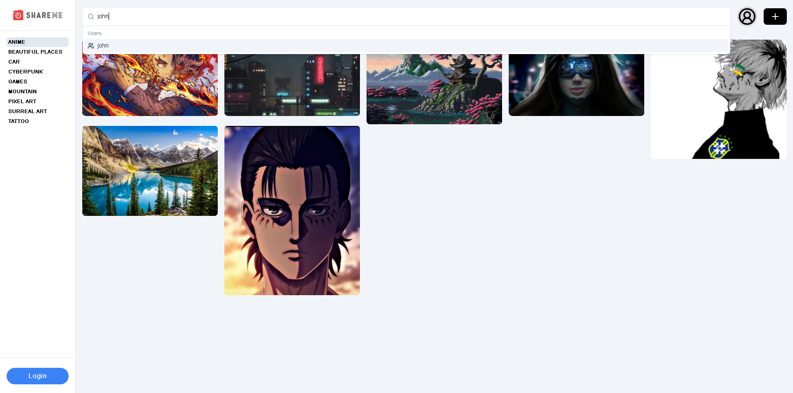
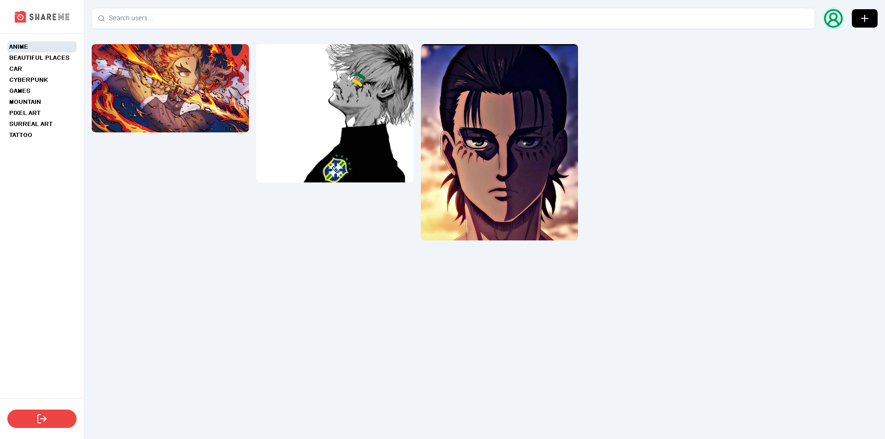
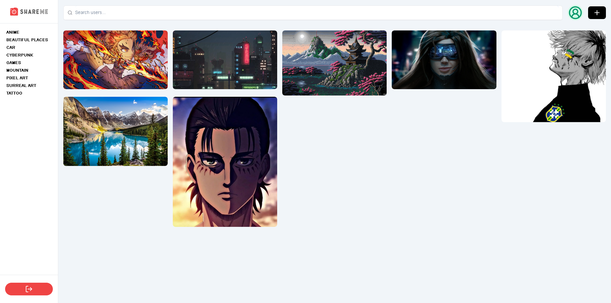
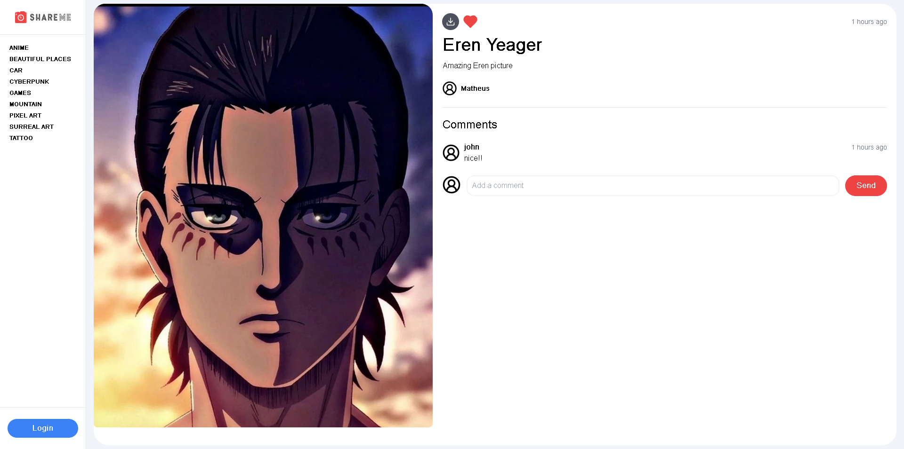
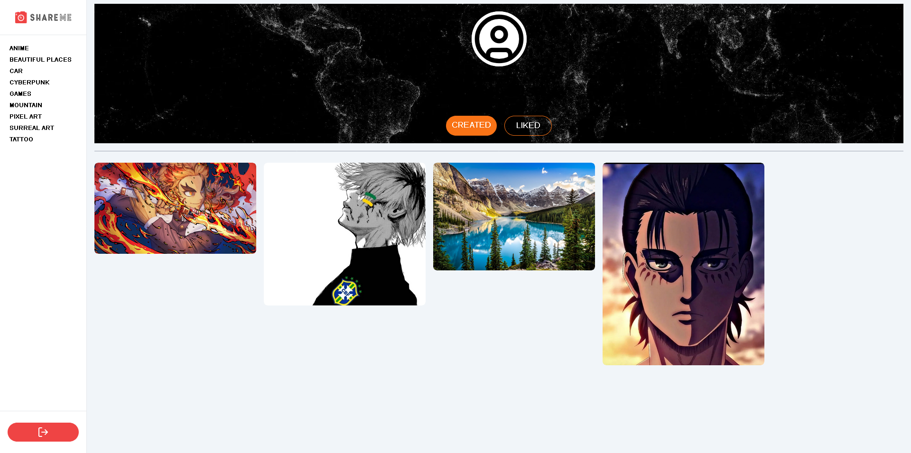
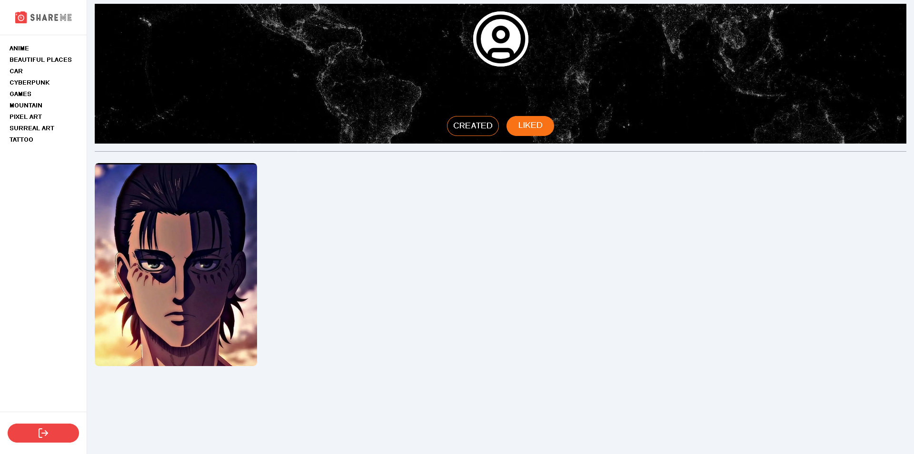

# Application - Shareme

Check the
[backend here](https://github.com/matheusjustino/shareme-backend-csharp)!

## Resume

    This is an image sharing application. It's possible to create an account to post your images,
    search for other users and see their posts, in addition to commenting and liking other posts.

## Information

**In this project were used:**
**`NextJs, NextAuth, TailwindCSS and Shadcn-ui`**. **as main tools and
technologies.**

## Application Screenshots

 
 
 

